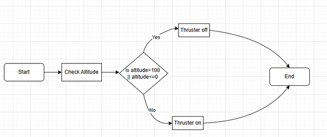

# Lunarlander

This repository contains my (s244871) code for this course's (62712) Lunarlander assignment.  
Below is the flowchart for how the program works.

## Files
- `Lunarlander.c` – main program code  
- `flowchart.png` – flowchart of the program
